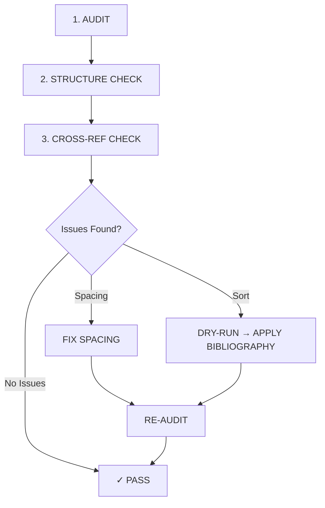

# AI Agent for Word Document Formatting, Auditing & Self-Healing (.agent_bc)

Welcome to the **Document & Report AI Agent (Agent BC)** v2.0. This specialized agent is designed to manage, format, audit, and heal Microsoft Word (.docx) documents, reports, and academic theses automatically.

## 1. Capabilities & Workflows

Agent BC works in a structured audit → fix → verify cycle:



**Core Features:**
1.  **8-Point Integrity Audit**: Duplicate refs, orphan/phantom citations, placeholders, captions, sort order, TOC config, soft breaks.
2.  **Structure Validation**: Checks all required thesis sections present and in correct order.
3.  **Cross-Reference Audit**: Validates `Hình X.Y` / `Bảng X.Y` match between body text and captions.
4.  **Self-Healing Spacing**: Fixes justification stretching while preserving all run-level formatting.
5.  **Dynamic Bibliography Sorting**: Parses, sorts, and re-indexes citations fully dynamically. Idempotent.

---

## 2. Directory Structure

```
.agent_bc/
├── AGENTS.md                           # Master agent configuration
├── README.md                           # This file
├── rules/
│   ├── doc-safety-rules.md             # Backup, dry-run, formatting safety rules
│   └── doc-project-context.md          # Thesis-specific context and standards
├── workflows/
│   └── doc-processing-cycle.md         # Audit → Fix → Verify cycle
├── skills/
│   ├── doc-formatting-standard/        # Font, heading, caption rules
│   ├── doc-spacing-self-healing/       # Soft-break healing algorithm
│   ├── doc-citation-plagiarism-audit/  # Citation sorting & plagiarism checks
│   ├── doc-structure-validator/        # Thesis structure completeness
│   └── doc-cross-reference-audit/      # Hình/Bảng cross-reference validation
└── scripts/
    ├── audit_doc_integrity.py          # 8-point integrity audit
    ├── fix_spacing_and_breaks.py       # Format-preserving spacing healer
    ├── standardize_bibliography.py     # Dynamic bibliography sorter
    ├── validate_structure.py           # Thesis structure validator
    └── validate_cross_references.py    # Figure/table cross-ref validator
```

---

## 3. Quick Start

```bash
# Step 1: Full audit (always run first)
python .agent_bc/scripts/audit_doc_integrity.py --path "path/to/doc.docx"

# Step 2: Structure check
python .agent_bc/scripts/validate_structure.py --path "path/to/doc.docx"

# Step 3: Cross-reference check
python .agent_bc/scripts/validate_cross_references.py --path "path/to/doc.docx"

# Step 4a: Fix spacing issues (if found)
python .agent_bc/scripts/fix_spacing_and_breaks.py --path "path/to/doc.docx"

# Step 4b: Preview bibliography changes (safe, no modification)
python .agent_bc/scripts/standardize_bibliography.py --path "path/to/doc.docx" --dry-run

# Step 4c: Apply bibliography sorting
python .agent_bc/scripts/standardize_bibliography.py --path "path/to/doc.docx"

# Step 5: Re-audit to confirm all issues resolved
python .agent_bc/scripts/audit_doc_integrity.py --path "path/to/doc.docx"
```

---

## 4. Safety Features

| Feature | Description |
|---------|-------------|
| **Timestamped Backups** | All modifying scripts create `_Backup_YYYYMMDD_HHMMSS.docx` before changes |
| **Dry-Run Mode** | `--dry-run` flag shows what would change without modifying |
| **Strict Mode** | `--strict` flag treats orphan references as errors instead of warnings |
| **Idempotent** | Running on an already-correct document makes zero changes |
| **Two-Pass Citation Replace** | Uses temp markers to prevent double-mapping corruption |
| **Format Preservation** | XML-level deep copy preserves bold, italic, fonts, colors |
| **Vietnamese Collation** | Proper Vietnamese alphabet order (A Ă Â B C D Đ E Ê ...) |

---

## 5. Dependencies

```bash
pip install python-docx lxml
```

Python 3.10+ recommended.
