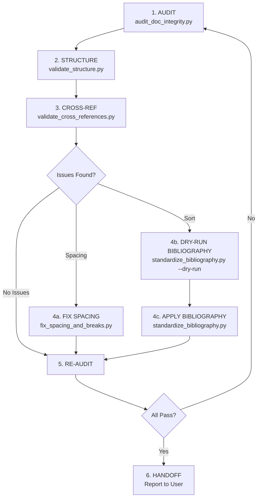

# Document Processing Cycle Workflow

## Purpose
Defines the end-to-end document processing cycle: audit → fix → verify, ensuring quality and data safety at every step.

## Cycle

### Step 1: AUDIT (Mandatory – Always run first)
- Run `audit_doc_integrity.py` to detect all issues: duplicate refs, orphan citations, placeholders, caption formatting, sort order, TOC config, soft breaks.
- Output: List of ERRORS and WARNINGS.

### Step 2: STRUCTURE (If structure validation needed)
- Run `validate_structure.py` to confirm all required sections are present: pledge, acknowledgment, abstract, TOC, chapters, conclusion, references.
- Output: Sections present/missing, heading hierarchy, chapter numbering.

### Step 3: CROSS-REF (If cross-reference validation needed)
- Run `validate_cross_references.py` to check that `Hình X.Y` / `Bảng X.Y` mentions in body text match actual captions.
- Output: Phantom refs, orphan captions, sequential numbering.

### Step 4: FIX (Based on issues detected)
- **4a. Spacing**: If audit detects soft breaks in justified paragraphs → run `fix_spacing_and_breaks.py`.
- **4b. Dry-run**: If audit detects sort issues → run `standardize_bibliography.py --dry-run` first to preview.
- **4c. Apply**: After confirming dry-run output is correct → run `standardize_bibliography.py` (without `--dry-run`).

### Step 5: RE-AUDIT (Mandatory after any fix)
- Re-run `audit_doc_integrity.py` to confirm all ERRORS are resolved.
- If ERRORS remain → return to Step 4.

### Step 6: HANDOFF
- Report results to user: issues fixed, remaining warnings, backup file paths.
- User confirms final pass.

## Stop Conditions
Agent MUST **STOP and ask for user input** before continuing if:
- Audit detects phantom citations (cited but no reference exists) – user must confirm which reference is missing.
- Dry-run shows the mapping will change many citations (>10 changes) – user must review.
- Script fails to parse headings (ref_heading, vi_heading, en_heading not found).
- Document has non-standard structure (missing required sections).
- Task requires editing academic content (outside formatting/citations scope).

## Handoff Checklist
- Summarize: number of issues fixed, backup files created, remaining warnings.
- Recommend user open the .docx in MS Word to visually verify before submission.
- Remind user to run "Update All Fields" (Ctrl+A → F9) in Word to refresh the TOC.
