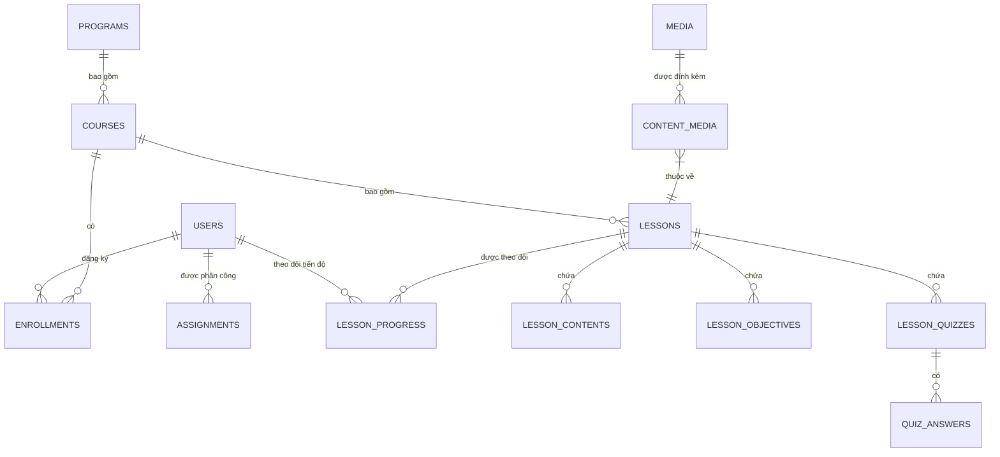
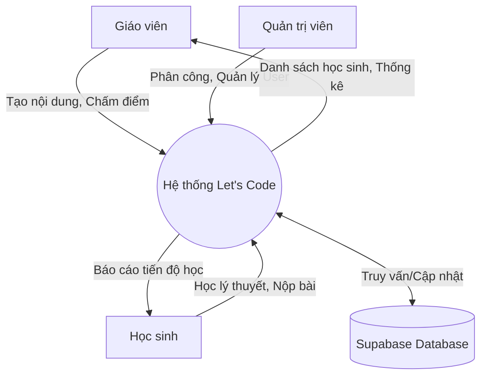
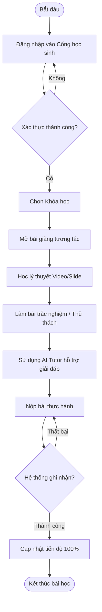

# HƯỚNG DẪN VẼ SƠ ĐỒ VÀ CHÈN ẢNH CODE VÀO BÁO CÁO

Để bài báo cáo trực quan và sinh động hơn, bạn hãy thực hiện theo các bước dưới đây để vẽ sơ đồ và chụp ảnh màn hình code chèn vào file Word.

## PHẦN 1: HƯỚNG DẪN VẼ SƠ ĐỒ BẰNG MERMAID
Bạn hãy truy cập vào trang web: **[Mermaid Live Editor](https://mermaid.live/)**
Sau đó copy các đoạn code dưới đây, dán vào cột "Code" bên trái của trang web. Trang web sẽ tự động vẽ ra sơ đồ bên phải. Bạn hãy lưu ảnh (hoặc chụp màn hình sơ đồ) và dán vào file Word.

### 1. Sơ đồ ERD (Entity Relationship Diagram)
* **Vị trí chèn trong Word:** Dưới mục **3.2.2 Tổng quan cấu trúc cơ sở dữ liệu**
* **Caption hình ảnh (Ghi chú dưới ảnh):** *Hình 3.1: Sơ đồ mối quan hệ thực thể (ERD) của hệ thống Let's Code*
* **Code Mermaid:**

### 2. Sơ đồ DFD (Data Flow Diagram) Mức ngữ cảnh
* **Vị trí chèn trong Word:** Dưới mục **3.1.1 Mục tiêu của hệ thống web bài giảng**
* **Caption hình ảnh (Ghi chú dưới ảnh):** *Hình 3.2: Sơ đồ luồng dữ liệu (DFD) mức ngữ cảnh của hệ thống*
* **Code Mermaid:**

### 3. Sơ đồ PFD (Process Flow Diagram) - Luồng học tập của học sinh
* **Vị trí chèn trong Word:** Dưới mục **3.7.7 Trình phát bài giảng tương tác (Interactive Lesson Player)**
* **Caption hình ảnh (Ghi chú dưới ảnh):** *Hình 3.3: Lưu đồ thuật toán quy trình học tập của học sinh*
* **Code Mermaid:**

---

## PHẦN 2: DANH SÁCH CÁC ĐOẠN CODE CẦN CHỤP ẢNH VÀ CHÈN

Bạn hãy mở phần mềm VS Code, mở các file dưới đây, khoanh vùng đoạn code quan trọng, chụp màn hình và dán vào Word theo đúng vị trí hướng dẫn.

### Ảnh Code 1: Khởi tạo kiến trúc Store / Context 
* **Vị trí chèn:** Dưới mục **3.4.1 Mô hình tổ chức mã nguồn**
* **Mở file:** `frontend/src/context/AuthContext.tsx`
* **Vùng chụp:** Phần định nghĩa `AuthContext` và `useAuth` (Tầm 15 - 20 dòng đầu).
* **Caption (Ghi chú):** *Hình 3.4: Khởi tạo Context API để quản lý trạng thái xác thực người dùng*

### Ảnh Code 2: Xử lý gộp dữ liệu khóa học (Data Aggregation)
* **Vị trí chèn:** Dưới đoạn chữ "...thay vì gọi API tuần tự, sử dụng Promise.all để kích hoạt các request song song..." ở mục **3.7.1.1**
* **Mở file:** `frontend/src/pages/admin/courses/AdminCoursesPage.tsx`
* **Vùng chụp:** Bên trong hàm `fetchCourses()`, đoạn gọi `Promise.all([api.get('/programs/1/courses'), ...])`.
* **Caption (Ghi chú):** *Hình 3.5: Thuật toán sử dụng Promise.all để gộp dữ liệu khóa học từ nhiều chương trình*

### Ảnh Code 3: Component AssignmentModal (Phòng tránh trùng lặp)
* **Vị trí chèn:** Dưới mục **3.7.3 Phân hệ quản lý nhân sự và phân công**
* **Mở file:** `frontend/src/pages/admin/teachers/components/AssignmentModal.tsx`
* **Vùng chụp:** Đoạn logic sử dụng hàm `filter` và `some` để loại bỏ các khóa học đã được phân công.
* **Caption (Ghi chú):** *Hình 3.6: Logic xử lý mảng để ngăn chặn phân công trùng lặp khóa học*

### Ảnh Code 4: Cập nhật giao diện lạc quan (Optimistic UI Update)
* **Vị trí chèn:** Dưới mục **3.6.3 Quản lý trạng thái và luồng dữ liệu**
* **Mở file:** `frontend/src/pages/admin/teachers/ManageTeachersPage.tsx` (Hoặc file quản lý course)
* **Vùng chụp:** Trong hàm `handleDeleteTeacher()`, đoạn mã `setTeachers(teachers.filter(t => t.id !== id))` ngay trước hoặc trong khi gọi API.
* **Caption (Ghi chú):** *Hình 3.7: Cập nhật giao diện tức thì (Optimistic UI) khi xóa bản ghi*

### Ảnh Code 5: Xử lý Backend Service (Tầng logic)
* **Vị trí chèn:** Dưới mục **3.3.4 Mô tả chi tiết các service backend đã xây dựng**
* **Mở file:** `backend/src/services/course.service.ts`
* **Vùng chụp:** Bất kỳ một hàm lớn nào (ví dụ: `createCourse` hoặc `updateCourse`) có xử lý logic Supabase.
* **Caption (Ghi chú):** *Hình 3.8: Cấu trúc xử lý nghiệp vụ tại tầng Service của Backend*

### Ảnh Code 6: Chức năng Chatbot AI (AI Tutor)
* **Vị trí chèn:** Dưới mục **3.7.7 Trình phát bài giảng tương tác**
* **Mở file:** `frontend/src/pages/student/ChallengeSandbox.tsx` (Hoặc component `AITutorChat`)
* **Vùng chụp:** Đoạn mã xử lý gọi API gửi tin nhắn tới Gemini (`/api/ai/chat`).
* **Caption (Ghi chú):** *Hình 3.9: Logic gọi API gửi tin nhắn và nhận phản hồi từ AI Tutor*
